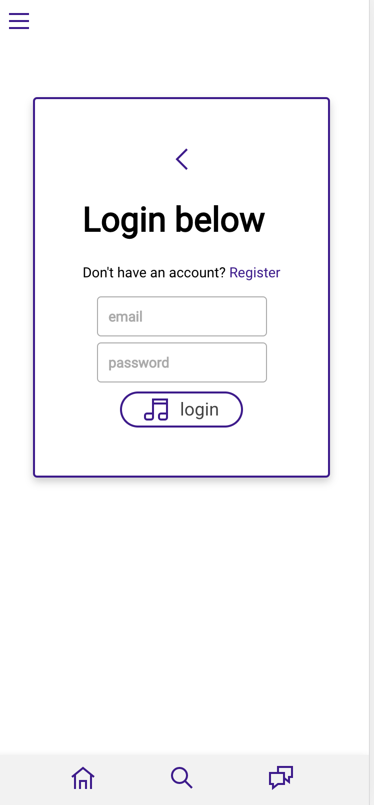
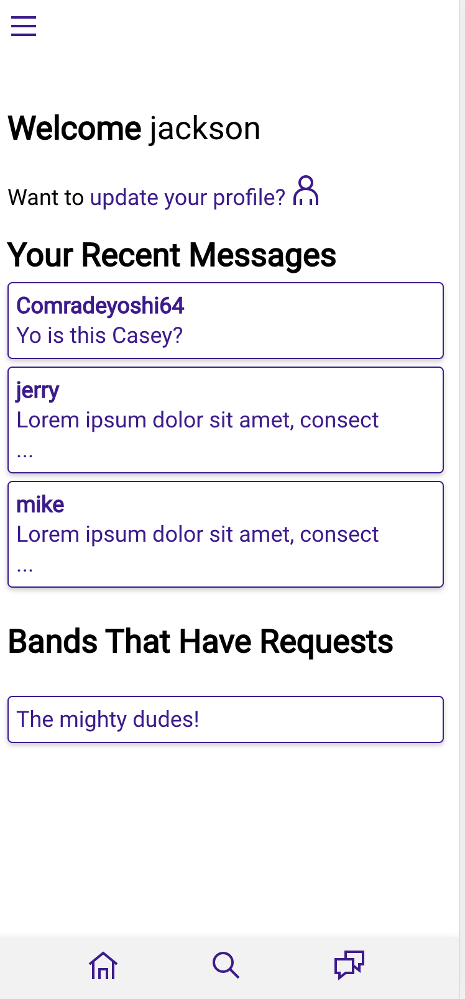
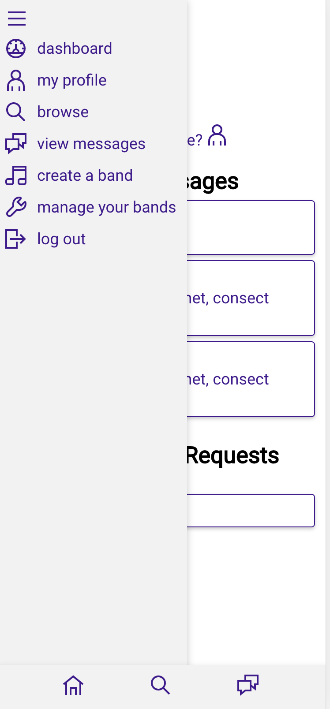
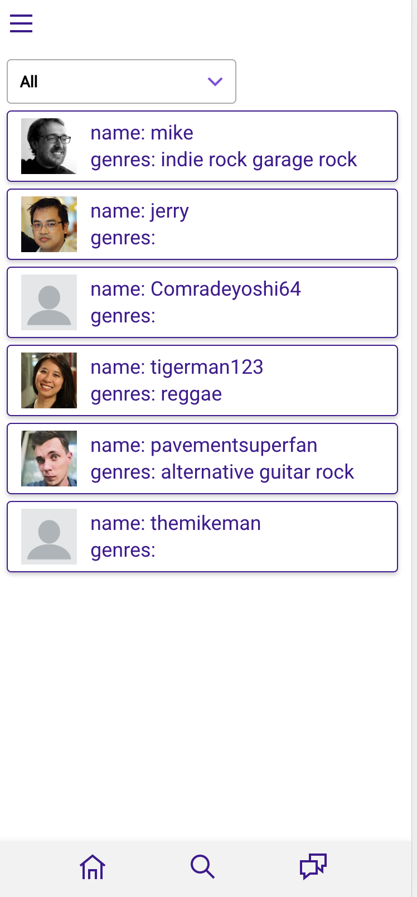
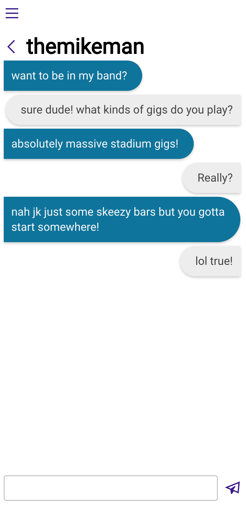
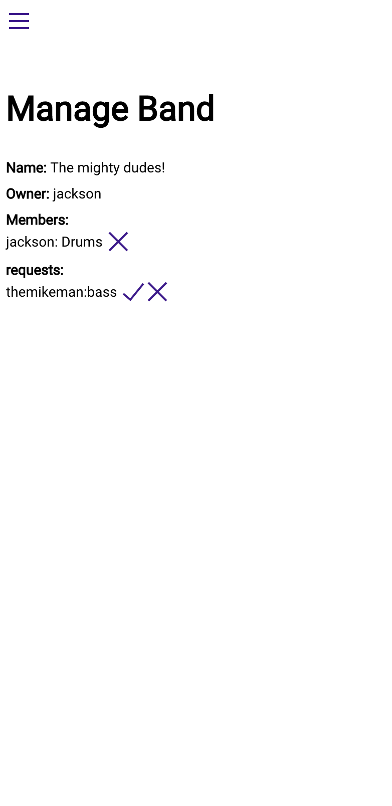

# Shy Band

#### A MERN stack app written by:

Jackson Oppenheim

https://lit-harbor-52969.herokuapp.com

---

### What is Shy Band?

I know from personal experience that it’s It’s hard to meet new musicians, especially when you move to a new city. Wouldn’t it be great if there was an app to help you meet other musicians and form a new band? Meet Shy Band! You can create an account, message other users, and form a band!

### NPM Dependencies

-  axios 0.19.0
-  bcryptjs 2.4.3
-  body-parser 1.18.3
-  classnames 2.2.6
-  concurrently 4.0.1
-  dotenv 8.1.0
-  express 4.16.4
-  grommet 2.7.9
-  grommet-controls 2.0.0-alpha1
-  grommet-icons 4.3.0
-  is-empty 1.2.0
-  jsonwebtoken 8.3.0
-  jwt-decode 2.2.0
-  mongoose 5.3.11
-  passport 0.4.0
-  passport-jwt 4.0.0
-  polished 3.4.1
-  react 16.6.3
-  react-burger-menu 2.6.11
-  react-dom 16.6.3
-  react-router-dom 5.1.2
-  react-scripts 2.1.1
-  react-scrollable-feed 1.0.4
-  redux 4.0.1
-  redux-thunk 2.3.0
-  styled-components 4.4.0
-  superagent 5.1.0
-  validator 10.9.0

### Security

Account creation and secure logging in is handled using Passport to hash passwords.

### Database

The database is a mongodb database running on mLABS that is accessed through an restful API using mongoose as an ORM.

As new users create accounts, an entry is added to the `User` collection, and their info is updated in the same collection. As users add instruments they play, genres they play, and their favorite bands, entries for those categories are added to the `Instrument`, `Genre`, and `FavoriteBands` collections respectively, and user `objectID`'s are added to an array of other users that have selected that as their category. These are kept separate in order to easily sort users based on these categories.

When a user creates a band, an entry is made in the `Band` collection with the `Owner` being an `objectID` reference to the user. As other users request to join, the user and their instrument are added to the `joinMembers` array in the band document, and as they're accepted, they're moved to the `bandMembers` array. If they're rejected, they're removed from the `joinMembers` array. If a user is removed from the band, they're removed from the `bandMembers` array.

When one user messages another user for the first time, an entry is created in the `Thread` collection. Their actual message is stored in the `Message` collection, and is pushed to an array in the `Thread` collection. The `Thread` collection serves as the connection point between users and their messages. As users talk to one another, their messages are added to the `Message` collection, and pushed to the appropriate thread.

### Server

The server is an express server running in node.

### Rendering

Rendering is handled through React using Grommet as a framework. The various pages are handled through React Router

### Photos








```
project
│   README.md
│   package.json
|   LICENSE - this is our MIT license
│   server.js - this our express server
│
└───client
    └───public - this folder contains the root index.html
    └───src - this contains all of the React components and the Redux store

└───config
    |   keys.js - this is an artifact from the original login app. All keys are stored securely in environmental variables
    |   mongoose.js - this contains the configuration that connects mongoose to mongodb
    |   passport.js - this contains the configuration for passport

└───models
    |   Band.js - this is the model for the Band collection
    |   FavoriteBand.js - this is the model for the FavoriteBand collection
    |   Genre.js - this is the model for the Genre collection
    |   index.js - this file links all of the models for ease of use in other files
    |   Instrument.js - this is the model for the Instrument document
    |   Message.js - this is the model for the Messages document
    |   Thread.js - this is the model for the Thread document
    |   User.js - this is the model for the User document


└───routes
    │   apiRoutes.js - this contains all of the routing information for API requests,
    └───api
        |   users.js - this contains the api routes for logging in, and regestering useing passport

└───validation
    |   login.js - this contains the strategy for logging in users
    |   register.js - this contains the strategy for registering users

```

#### License

This application is under the MIT licence.
